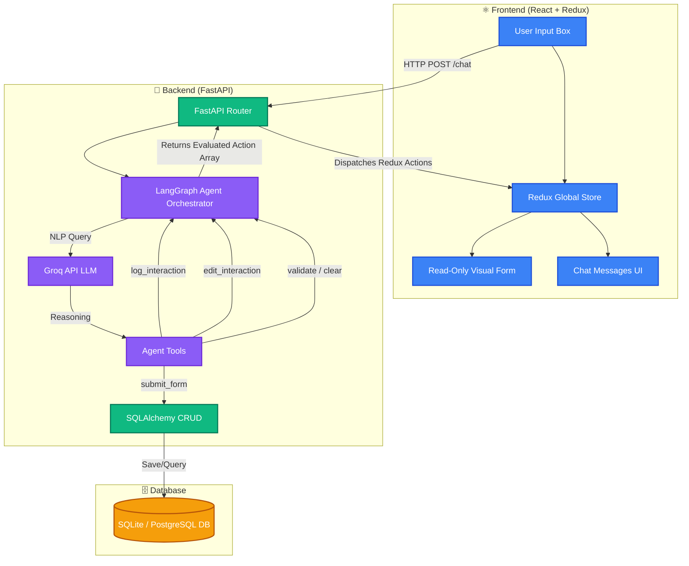

# 🩺 AI-First CRM: HCP Log Interaction System

Welcome to the **AI-First CRM Prototype**, an advanced Medical CRM system where all data entry is strictly automated and curated by an intelligent LangGraph AI Assistant. Built for Healthcare Professional (HCP) interactions, this system eliminates manual typing, leveraging natural language reasoning to perfectly extract, populate, and save interactions to the database flawlessly.

---

## 🏗️ Architecture & System Flow

The architecture strictly follows a decoupled modern structure with specific roles per tier. Data moves organically via agent intelligence: **User → React Frontend → FastAPI Router → LangGraph Agent → Groq LLM (Llama 3) → Tools Array → Database.**



---

## 📂 Project Structure

This project enforces strict modular boundaries:

```text
hcp-crm/
│
├── frontend/             # React/Vite/TypeScript frontend
│   ├── src/
│   │   ├── components/   # LeftPanel.tsx (Form), RightPanel.tsx (Chat)
│   │   ├── store/        # Redux Toolkit state slices
│   │   └── api.ts        # Axios integrations
│   └── package.json
│
├── agent/                # AI Agent logic and orchestration
│   └── graph.py          # LangGraph create_react_agent logic
│
├── tools/                # AI Function Calling primitives
│   └── agent_tools.py    # Tools: log, edit, validate, clear, submit
│
├── database/             # Database architecture & bindings
│   ├── database.py       # SQL Engine Initializer
│   ├── models.py         # SQLAlchemy Base classes definitions
│   └── crud.py           # DB row operations
│
├── routes/               # API endpoints
│   └── api.py            # /chat, /save, /interactions endpoints
│
├── backend/              # Server configuration
│   └── main.py           # Application Entrypoint (FastAPI)
│
├── crm.db                # Active SQLite Database File (auto-generated)
├── requirements.txt      # Python backend dependencies
└── .env                  # Environment Variables (GROQ_API_KEY)
```

---

## 🛠️ Database Architecture

The CRM safely persists structured interactions using **SQLAlchemy** ORM.

**Table Models**: `Interaction`
* `id` *(Integer, Primary Key)*
* `hcp_name` *(String, Indexed)*: Extracted doctor/clinician name.
* `date` *(String)*: Recorded interaction date.
* `product` *(String)*: Mentioned pharmaceutical or medical product.
* `sentiment` *(String)*: Qualitative tone of the meeting.
* `follow_up` *(String)*: Required scheduling or action tasks.
* `notes` *(Text)*: Elaborated reasoning and observations.

> **Note**: While structurally engineered to seamlessly integrate with PostgreSQL environments via `DATABASE_URL` environment variables, the system falls back to standalone SQLite (`sqlite:///./crm.db`) to enable friction-free local iteration out of the box.

---

## 🚀 Getting Started

### 1. Requirements
* Node.js (v18+)
* Python (3.9+)

### 2. Environment Setup
Create a `.env` file directly securely in the root `/hcp-crm/` directory with your Groq API key:
```env
GROQ_API_KEY=gsk_your_api_key_here
```

### 3. Start the Backend API
The backend intentionally runs from the **root directory** to properly resolve cross-module architecture imports.
```bash
# Create and activate virtual environment
python -m venv venv
venv\Scripts\activate

# Install requirements
pip install -r requirements.txt

# Start the uvicorn server on port 8000
uvicorn backend.main:app --reload --port 8000
```

### 4. Start the Frontend Application
In a new terminal window:
```bash
cd frontend
npm install
npm run dev -- --port 5173
```

Navigate to `http://localhost:5173/` in your browser.

---

## 🤖 System Flow Explanation

The interaction pattern natively forbids manual typing in the CRM form:

1. **Natural Input**: You type a conversational prompt into the chat (e.g., *"Met Dr. Sharma regarding CardioX, he was very happy. Follow up next week. Notes: Mentioned pricing concerns."*).
2. **AI Iteration**: LangGraph evaluates the text alongside your current Redux form state, deciding exactly which tool to call (`log_interaction`).
3. **Sequential Pipeline**: The agent natively structures multiple steps. It might choose to log the interaction to build state, then gracefully call `submit_form` automatically.
4. **Client Handoff**: The API returns an array of specific functional actions.
5. **Redux Render**: React progressively processes the operations, dispatching updates to Redux, beautifully rendering `Framer Motion` stagger animations as the Left Panel magically auto-fills itself!

---

## 🎥 Demo Video Script (10–15 Minutes)

**Overview:** 
This script is designed for a professional, step-by-step presentation of the AI-First CRM Prototype. Speak naturally, confidently, and rely on simple English to convey complex concepts.

### 1. INTRO (0:00 – 0:45)
**[DO: Show your face on camera, smiling confidently]**
**SAY:** "Hi everyone, I'm [Your Name], and today I want to show you an AI-First CRM I built specifically for healthcare professionals. The big idea here is simple: we are replacing manual form entry entirely with an AI agent. No more typing into boxes—just chat with the AI, and it does the work for you."

### 2. PROBLEM STATEMENT (0:45 – 1:45)
**[DO: Share screen showing a typical, boring old-school form briefly, or just show the blank CRM screen]**
**SAY:** "Traditional CRMs have a huge problem. They require doctors and sales reps to spend hours manually typing data, clicking dropdowns, and fixing errors. It's slow and frustrating. My solution flips this around. In this CRM, the form is completely read-only. You cannot click and type. Instead, an AI listens to what happened during your meeting and handles all the strict data entry itself."

### 3. LIVE DEMO (1:45 – 8:00)

#### A. Log Interaction Tool (1:45 – 3:00)
**[DO: Share screen of the HCP CRM. Point to the chat box on the right and the read-only form on the left.]**
**SAY:** "Let's see it in action. I just finished a meeting. I'll simply tell the chat: 'Met Dr. Sharma today to discuss CardioX. He was very positive. Follow up next Friday. Notes: He asked about the new pricing structure.'"
**[DO: Type exactly that into the chat and hit send.]**
**SAY:** "Watch the form on the left. The AI automatically understands my natural language, extracts the doctor's name, the product, the sentiment, the dates, and the notes, and fills out the form perfectly. I didn't click a single box."

#### B. Edit Tool (3:00 – 4:15)
**[DO: Point to the form where 'CardioX' is written.]**
**SAY:** "Now, what if I made a mistake? Since I can't type in the form, I just tell the AI to fix it. Let's say: 'Wait, I actually talked to him about NeuroZ, not CardioX.'"
**[DO: Type the correction into the chat and hit send.]**
**SAY:** "The AI intuitively knows which field to change. It updates the Product field to NeuroZ but leaves everything else exactly the same. This is our Edit Tool working seamlessly in the background."

#### C. Validation Tool (4:15 – 5:30)
**[DO: Click 'Clear' or ask the AI to clear the form. Then type an incomplete log: 'Met Dr. Patel but forgot what we discussed.']**
**SAY:** "Data quality is critical. Let's provide an incomplete entry and see what happens."
**[DO: Hit send on the incomplete prompt.]**
**SAY:** "The AI uses a Validation Tool. It looked at the required fields, noticed we are missing the product and sentiment, and is now asking me directly in the chat to provide those missing details before it allows the form to be saved."

#### D. Submit Tool (5:30 – 6:45)
**[DO: Fill in the missing details so the form is completely valid: 'We discussed the new MRI machine and she was very happy.']**
**SAY:** "Once the form looks perfectly valid, I can just tell the AI, 'Save this interaction.' "
**[DO: Type 'Save this' into the chat and send.]**
**SAY:** "The agent triggers the Submit Tool, saving all this structured data directly into our database safely and reliably."

#### E. Clear Tool (6:45 – 8:00)
**[DO: Look at the saved state in the UI.]**
**SAY:** "And finally, to get ready for my next meeting, I just say 'Clear the form'."
**[DO: Type 'Clear the form' and send.]**
**SAY:** "The Clear Tool resets our application state instantly. We are fresh and ready for the next interaction."

### 4. ARCHITECTURE EXPLANATION (8:00 – 10:00)
**[DO: Show a high-level architecture diagram or simply point to the Github project structure.]**
**SAY:** "So how does this work under the hood? It's a fully decoupled architecture. The frontend is built with React and Redux to manage our state. When I send a chat, it routes to a FastAPI backend. From there, it's handed off to LangGraph, which acts as our agent orchestrator. The actual brain is the Groq LLM, specifically the gemma2-9b-it model, which processes the text incredibly fast. Once the AI decides what to do, it saves data to our SQLAlchemy database."

### 5. LANGGRAPH EXPLANATION (10:00 – 12:00)
**[DO: Show the LangGraph graph.py or agent_tools.py code on screen.]**
**SAY:** "The most important part here is LangGraph. This isn't just a simple chatbot using traditional if-else statements. It's a tool-based AI agent. I provided the LLM with a set of specific tools—Log, Edit, Validate, Submit, and Clear. When I send a message, there is no hardcoded logic telling the system 'if the user says save, perform the save function'. Instead, the LLM itself reads my prompt, understands context, and intelligently decides which tool to call and with what parameters. It essentially acts on its own reasoning."

### 6. WHAT I LEARNED (12:00 – 13:30)
**[DO: Bring the camera back to just your face, speaking directly to the viewer.]**
**SAY:** "Building this taught me a lot about AI-first design. We are moving away from building interfaces that users have to click through, toward conversational systems where the AI acts as an invisible operator. I also learned how powerful LangGraph is at keeping LLMs focused, ensuring they actually execute strict business workflows rather than just chatting back and forth."

### 7. CONCLUSION (13:30 – 15:00)
**[DO: Show the final running dashboard one more time, then back to face.]**
**SAY:** "In conclusion, AI is completely changing how CRM systems should work. By removing manual data entry, we let sales reps and doctors focus on their real jobs, not on fighting with software. Thanks for watching, and I hope you enjoyed seeing what an AI-first application looks like in the real world."
