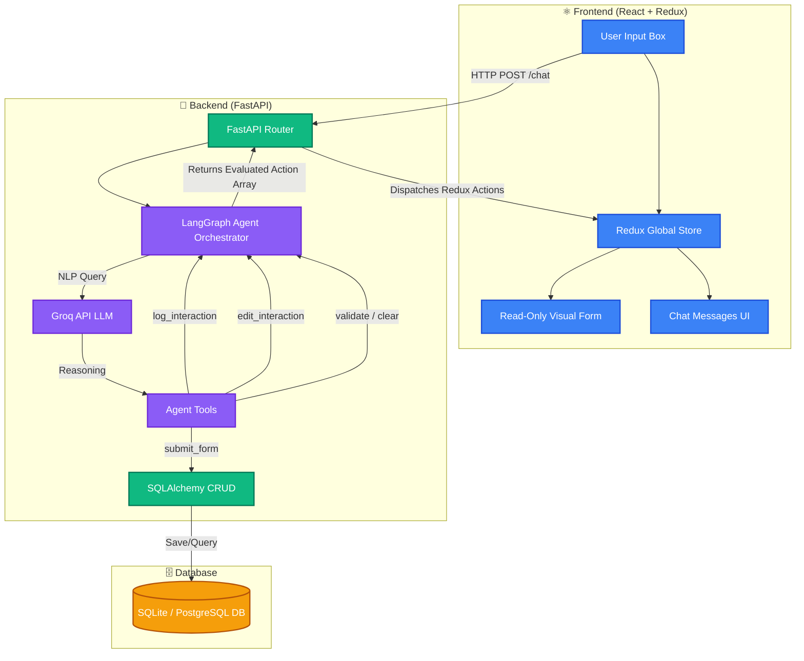

# langgraph-ai-crm-hcp
A next-generation AI-first CRM system where LLM-powered agents replace traditional form-based workflows, enabling intelligent and automated HCP interaction management.

# 🩺 AI-First CRM: HCP Log Interaction System

Welcome to the **AI-First CRM Prototype**, an advanced Medical CRM system where all data entry is strictly automated and curated by an intelligent LangGraph AI Assistant. Built for Healthcare Professional (HCP) interactions, this system eliminates manual typing, leveraging natural language reasoning to perfectly extract, populate, and save interactions to the database flawlessly.

---

## 🏗️ Architecture & System Flow

The architecture strictly follows a decoupled modern structure with specific roles per tier. Data moves organically via agent intelligence: **User → React Frontend → FastAPI Router → LangGraph Agent → Groq LLM (Llama 3) → Tools Array → Database.**



---

## 📂 Project Structure

This project enforces strict modular boundaries:

```text
hcp-crm/
│
├── frontend/             # React/Vite/TypeScript frontend
│   ├── src/
│   │   ├── components/   # LeftPanel.tsx (Form), RightPanel.tsx (Chat)
│   │   ├── store/        # Redux Toolkit state slices
│   │   └── api.ts        # Axios integrations
│   └── package.json
│
├── agent/                # AI Agent logic and orchestration
│   └── graph.py          # LangGraph create_react_agent logic
│
├── tools/                # AI Function Calling primitives
│   └── agent_tools.py    # Tools: log, edit, validate, clear, submit
│
├── database/             # Database architecture & bindings
│   ├── database.py       # SQL Engine Initializer
│   ├── models.py         # SQLAlchemy Base classes definitions
│   └── crud.py           # DB row operations
│
├── routes/               # API endpoints
│   └── api.py            # /chat, /save, /interactions endpoints
│
├── backend/              # Server configuration
│   └── main.py           # Application Entrypoint (FastAPI)
│
├── crm.db                # Active SQLite Database File (auto-generated)
├── requirements.txt      # Python backend dependencies
└── .env                  # Environment Variables (GROQ_API_KEY)
```

---

## 🛠️ Database Architecture

The CRM safely persists structured interactions using **SQLAlchemy** ORM.

**Table Models**: `Interaction`
* `id` *(Integer, Primary Key)*
* `hcp_name` *(String, Indexed)*: Extracted doctor/clinician name.
* `date` *(String)*: Recorded interaction date.
* `product` *(String)*: Mentioned pharmaceutical or medical product.
* `sentiment` *(String)*: Qualitative tone of the meeting.
* `follow_up` *(String)*: Required scheduling or action tasks.
* `notes` *(Text)*: Elaborated reasoning and observations.

> **Note**: While structurally engineered to seamlessly integrate with PostgreSQL environments via `DATABASE_URL` environment variables, the system falls back to standalone SQLite (`sqlite:///./crm.db`) to enable friction-free local iteration out of the box.

---

## 🚀 Getting Started

### 1. Requirements
* Node.js (v18+)
* Python (3.9+)

### 2. Environment Setup
Create a `.env` file directly securely in the root `/hcp-crm/` directory with your Groq API key:
```env
GROQ_API_KEY=gsk_your_api_key_here
```

### 3. Start the Backend API
The backend intentionally runs from the **root directory** to properly resolve cross-module architecture imports.
```bash
# Create and activate virtual environment
python -m venv venv
venv\Scripts\activate

# Install requirements
pip install -r requirements.txt

# Start the uvicorn server on port 8000
uvicorn backend.main:app --reload --port 8000
```

### 4. Start the Frontend Application
In a new terminal window:
```bash
cd frontend
npm install
npm run dev -- --port 5173
```

Navigate to `http://localhost:5173/` in your browser.

---

## 🤖 System Flow Explanation

The interaction pattern natively forbids manual typing in the CRM form:

1. **Natural Input**: You type a conversational prompt into the chat (e.g., *"Met Dr. Sharma regarding CardioX, he was very happy. Follow up next week. Notes: Mentioned pricing concerns."*).
2. **AI Iteration**: LangGraph evaluates the text alongside your current Redux form state, deciding exactly which tool to call (`log_interaction`).
3. **Sequential Pipeline**: The agent natively structures multiple steps. It might choose to log the interaction to build state, then gracefully call `submit_form` automatically.
4. **Client Handoff**: The API returns an array of specific functional actions.
5. **Redux Render**: React progressively processes the operations, dispatching updates to Redux, beautifully rendering `Framer Motion` stagger animations as the Left Panel magically auto-fills itself!
